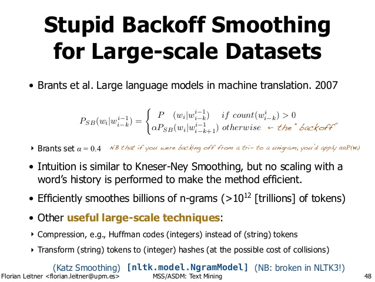

#### Read me ####

The application was created for the Capstone Project for Johns Hopkins University, as well as an final assignment for DS 300.

#### Word Prediction app 
    
The Word Prediction app uses an ngram languaged model to process unstructured twitter, blog and news text

The corpus text consist of English, Finnish and German text and
can be downloaded [[JHU DS Capstone Swiftkey Dataset]] (https://d396qusza40orc.cloudfront.net/dsscapstone/dataset/Coursera-SwiftKey.zip).

For this application, Bigram, Trigram, 4- gram and Unigram are preocessed through "stupid back off".
The algorthim can calculating predictions over largedata datasets. With ngram 

The mathematical model for Stupid Backoff model is listed below

 

In the interest of speed, the N-gram models have been pre-processed and resulting computations are saved into CSV files which the application reads in during initialization.

#### Presentable Slides and replicable codes.

Presentation slides fo this application may be found in: 

Application code for this is available in github: 

1. Shiny Application code: 
2. N-gram modelling codes: 
